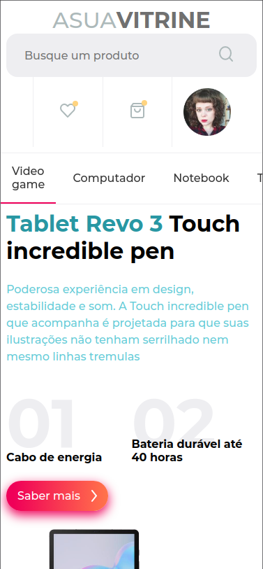
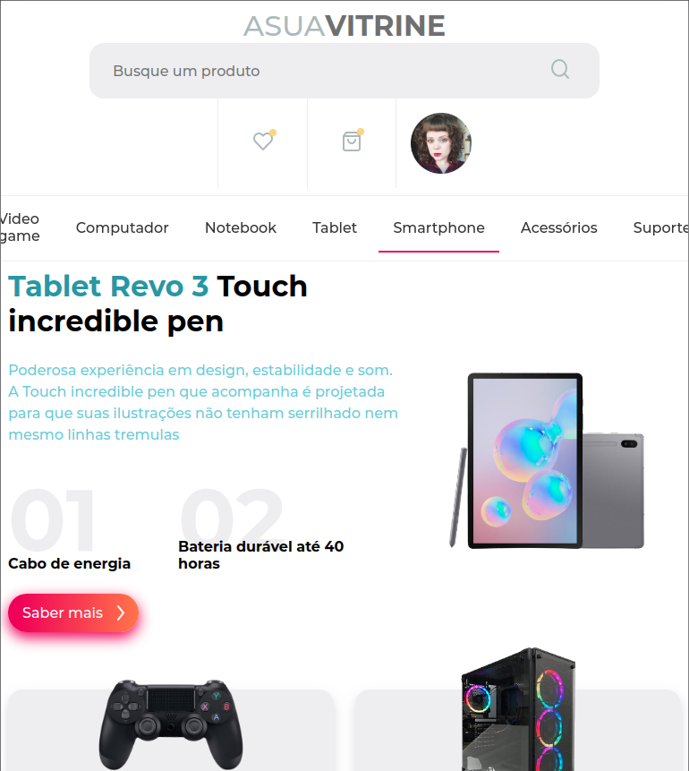
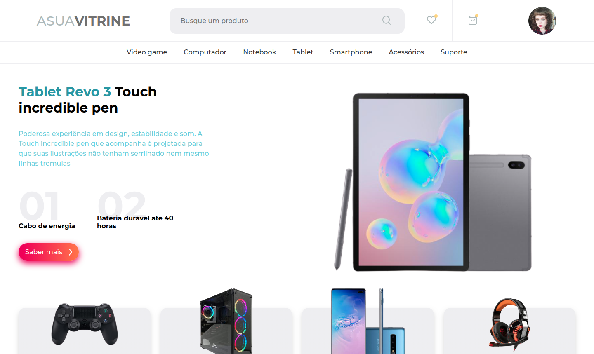

# A Sua Vitrine

---

Desenvolvido em Live na [Twitch](https://www.twitch.tv/videos/787152219)

O Site foi desenvolvido apenas com o intuito de treinar e repassar o conhecimento sobre CSS.

Quer visualizar em seu computador ou clonar o repositório, use o commando:

`git clone https://github.com/jeanmolossi/a-sua-vitrine.git`

## :art: Materiais

[Figma](https://www.figma.com/file/A07Rbkf3geXpEPOuhjjZnx/e-commerce?node-id=0%3A1)

## Preview

Smartphones

Tablets

Desktop

